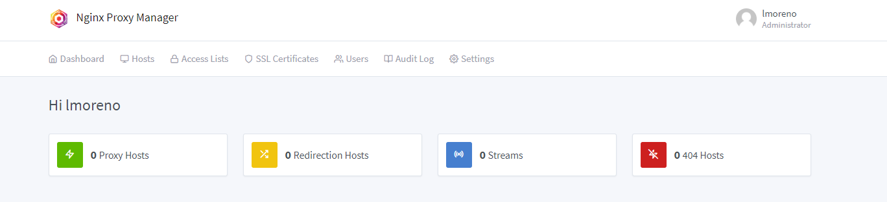

# Nginx Proxy Manager 🌐 
Repositorio basico - Nginx Proxy Manager


## 📑 Tabla de Contenidos  
1. [Descripción](#descripcion)  
2. [Requerimientos previos](#requerimientos)  
3. [Instalación](#instalacion)  
4. [Uso](#uso) 
5. [Capturas de pantalla](#capturas-pantalla)  
6. [Contribuciones](#contribuciones)  
7. [Licencia](#licencia) 
8. [Contacto](#contacto) 

## 📝 Descripción <a id="descripcion"></a>
- Este repositorio permite levantar un docker con un Nginx Proxy Manager.
- Nginx Proxy Manger es un servidor proxy que permite facilitar las configuraciones de un `servidor proxy inverso`, `Certificados SSL` y la gestión de host de servidores. Esta diseñado para facilitar las configuraciones de Nginx brindando una interfaz grafica cómoda y simple.

## ✅ Requerimientos previos <a id="requerimientos"></a>
- Se debe tener instalado previamente `docker` y `docker-compose`

## 🛠️ Instalación <a id="instalacion"></a> 
```bash
# Clonar el repositorio
git clone https://github.com/inglucasmoreno/nginx-proxy-manager.git
```

## 🧑‍💻 Uso <a id="uso"></a> 

```bash
# Iniciar servicios con docker compose
docker compose up -d
```

- Ingresar en el navegador a la direccion `http://localhost:81` para abrir phpMyAdmin
- Los datos por defecto de ingreso son:
```Copy
Email: admin@example.com
Password: changeme
```
- Una vez ingresar, se te pedira cambiar la contraseña por una nueva.
- Despues de esto ya estas listo para utilizar Nginx Proxy Manager.

## 📸 Capturas de Pantalla <a id="capturas-pantalla"></a>
- Login


- Pantalla principal



## 🤝 Contribuciones <a id="contribuciones"></a> 
¡Toda contribución es bienvenida! Por favor sigue los pasos:  
1. Haz un fork del repositorio.  
2. Crea una rama (`git checkout -b feature/nueva-funcionalidad`).  
3. Envía un pull request.

## 📜 Licencia <a id="licencia"></a>  
Este proyecto está bajo la licencia MIT. Consulta el archivo [LICENSE](./LICENSE) para más detalles.

## 📧 Contacto <a id="contacto"></a>  
Hecho por [Ing. Moreno Lucas Omar](https://github.com/inglucasmoreno). 